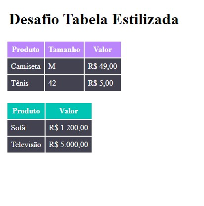

# Desafio Tabela Personalizada

Esse repositório se trata do primeiro desafio do curso DevQuest, onde personalizamos uma tabela simples com um arquivo CSS externo.


<br><br>

## Tecnologias Usadas
-  HTML 5
-  CSS 3
<br><br>

## Aprendizado

Nesse desafio utilizamos classes para aplicar estilos diferentes nas tabelas como:

<strong>OBS: Usamos esses atributos de forma global também.</strong>
```
margin:
padding:
```

```
background-color:
color:
text-align:
```
## Dificuldades

Tive dificuldades ao decidir nomes das classes e saber quando usa-las.